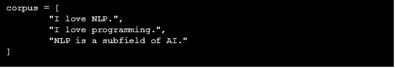
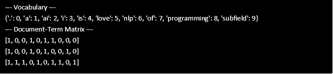
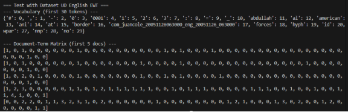

# Báo cáo Lab 2: CountVectorizer
## 1\. Các bước triển khai
### Interface Vectorizer
- Trong src/core/interfaces.py định nghĩa abstract class Vectorizer với ba phương thức:
  - fit(self, corpus: list[str]) → học vocabulary từ corpus.
  - transform(self, documents: list[str]) -> list[list[int]] → biến đổi văn bản thành vector.
  - fit\_transform(self, corpus: list[str]) -> list[list[int]] → kết hợp cả fit và transform.
### ` `Triển khai CountVectorizer
- Tạo file src/representations/count\_vectorizer.py.
- Class CountVectorizer kế thừa Vectorizer, nhận một Tokenizer (từ Lab 1).
- Các bước chính:
  - **fit**: duyệt qua corpus, dùng tokenizer tách token, thu thập token duy nhất → xây vocabulary.
  - **transform**: duyệt qua mỗi document, tạo vector đếm tần suất token theo vocabulary.
  - **fit\_transform**: thực hiện cả 2 bước liên tiếp.
### Triển khai **Evaluation**
- Tạo file test/lab2\_test.py.
- Test trên:
  - **Corpus mẫu**: 3 câu ngắn.
  - **Dataset UD English EWT**: đọc file en\_ewt-ud-train.txt, lấy sample text, chia thành documents, token hóa và vector hóa.
## 2\. Cách chạy code và log kết quả
### Test 1: Corpus mẫu
**Input corpus:**

**Output corpus:**

### Test 2: Dataset UD English EWT
- Đọc file en\_ewt-ud-train.txt.
- Lấy 500 ký tự đầu làm sample.
- Tách documents theo dấu ".".
- Fit & transform bằng CountVectorizer.

**Output:**

## 3\. Giải thích kết quả
### ` `Corpus mẫu:
- Vocabulary gồm cả dấu chấm ".".
- Mỗi document được biểu diễn thành vector, trong đó mỗi giá trị là số lần token xuất hiện.
### Dataset UD English EWT:
- Vocabulary lớn và đa dạng (bao gồm cả ký tự đặc biệt, chữ, số).
- Document-term matrix phản ánh tần suất token trong các câu thực tế.

Điều này cho thấy CountVectorizer đã thực hiện đúng chức năng: biến văn bản thành dạng số để sẵn sàng cho các bước ML tiếp theo.

## 4\. Khó khăn và cách giải quyết
\- Khó khăn 1: Import module trong Python.\
`  `Giải pháp: Thêm sys.path.append(...) trong main.py.

\- Khó khăn 2: Đồng bộ với tokenizer. \
Giải pháp: chọn RegexTokenizer để tách token chi tiết và nhất quán.
## 5\. Tham khảo
\- Python re (regular expressions).\
\- Universal Dependencies dataset: https://universaldependencies.org/\
\- Tài liệu và slide lab giảng viên cung cấp.
